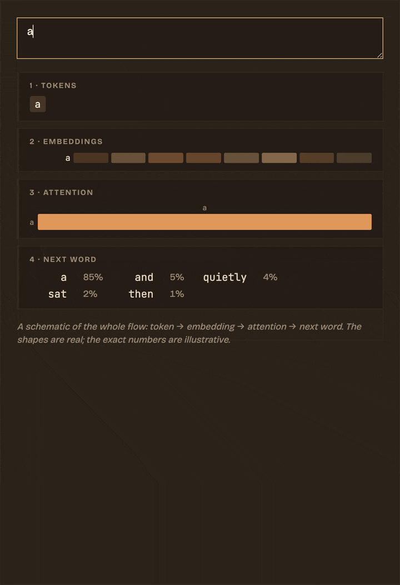

# Oliveaniss

*An explorable garden about how modern AI actually works.*



<p align="center"><em>Type a sentence and watch the whole model run — tokens, embeddings, attention, next word — recomputing as you type. Nothing here is a diagram; it is the thing itself.</em></p>

Most explanations of machine learning hand you one of two things: a wall of equations, or a metaphor so loose it falls apart the moment you lean on it. I wanted a third option — pages you can poke at. Every idea here (tokens, embeddings, attention, sampling, training) comes with a small widget you can type into, drag, or watch run. Change the input and the whole thing recomputes in front of you.

The site is live at **https://my-web-seven-brown-60.vercel.app**.

## Where to start

Five explainers build on one another, roughly in the order a sentence travels through a model:

1. [The atoms of a model](https://my-web-seven-brown-60.vercel.app/posts/tokens-the-atoms-of-llms) — watch your words dissolve into tokens.
2. [Embeddings, explained](https://my-web-seven-brown-60.vercel.app/posts/embeddings-explained) — where meaning turns into distance on a map.
3. [How a transformer thinks](https://my-web-seven-brown-60.vercel.app/posts/how-a-transformer-thinks) — click a word and see attention light up.
4. [Temperature and the next word](https://my-web-seven-brown-60.vercel.app/posts/temperature-and-sampling) — load the model's dice and watch it get weird.
5. [Watch a model learn](https://my-web-seven-brown-60.vercel.app/posts/watch-a-model-learn) — roll a ball downhill; that is training.

If you would rather see the whole thing at once, [the entire model on one screen](https://my-web-seven-brown-60.vercel.app/posts/the-whole-model) runs all four stages together for whatever sentence you type. And [teach a neuron](https://my-web-seven-brown-60.vercel.app/posts/teach-a-neuron) lets you draw your own data and watch a single unit try to fit it.

Around the essays sits a set of short [concept notes](https://my-web-seven-brown-60.vercel.app/thoughts/) — a small, cross-linked encyclopedia of terms like attention, softmax, RAG, and context window. They are meant to be wandered, not read front to back. The home page opens on a force-directed graph of how they connect, plus a second map that places every note by *meaning* rather than by links.

## The explorables

The clip at the top of this page is one of them — the pipeline widget from [the whole model on one screen](https://my-web-seven-brown-60.vercel.app/posts/the-whole-model). Each widget begins life as a plain placeholder in Markdown:

```html
<div class="explorable" data-explorable="attention"></div>
```

One site-wide script finds every placeholder on a page and hydrates it into a live canvas or SVG. The widgets read the site's theme variables directly, so they recolour themselves the instant you flip between day and night.

There are about a dozen of them. A few I am fond of:

- **pipeline** — the screenshot above: token, embedding, attention, and next word, end to end, recomputed as you type.
- **ask** and **garden-map** — both run a real sentence-embedding model *in your browser*, with no server involved. "Ask the garden" ranks every note by how close it sits to your question in meaning; the garden map is a two-dimensional projection of those same embeddings.
- **attention** — click any word in a sentence and watch which other words it leans on.
- **learn** and **gradient-descent** — the training loop drawn as a surface, with a model sliding down toward the low point.
- **commits** — the contribution calendar on the home page, pulled live from GitHub.

## Look and feel

Two warm, two-ink palettes: an oat-milk "latte" for day and a deep-espresso "cacao" for night, both lit with caramel and amber. Headings are set in DM Serif Display, body copy in Bricolage Grotesque, and anything code-like in JetBrains Mono.

<table>
  <tr>
    <td width="50%"></td>
    <td width="50%"></td>
  </tr>
  <tr>
    <td align="center"><em>Day — latte</em></td>
    <td align="center"><em>Night — cacao</em></td>
  </tr>
</table>

## Built with

- **Quartz** — a static-site generator that turns a folder of Markdown into a linked website. It is MIT-licensed and heavily customised here.
- **Preact**, rendered to static HTML at build time.
- **unified / remark / rehype** for the Markdown-to-HTML pipeline, with KaTeX for maths and Shiki for syntax highlighting.
- **Transformers.js** for the in-browser embedding model behind "ask the garden" and the meaning-map.
- A small **Pixi / WebGL** graph for the home-page node view.

All of the interactive widgets live in a single file, `quartz/components/scripts/explorables.inline.ts`. The rest of `quartz/` is the engine.

## Running it locally

You will need Node 22 or newer.

```bash
npm install
npx quartz build --serve
```

Then open http://localhost:8080. Edits under `content/` reload on save.

## Repository layout

```
content/            the garden itself — every note and essay, in Markdown
  posts/            the long-form explainers
  thoughts/         short concept notes
quartz/             the static-site engine (Preact SSR + remark/rehype)
  components/       page components and the explorable widgets
quartz.config.ts    site config: theme, fonts, plugins
quartz.layout.ts    what goes where on each page
```

## Deploying

Every push to `main` triggers a build on Vercel (`npx quartz build`, output written to `public/`). Pushing to any other branch gives you a preview URL for that branch.

## Credits

Built on the Quartz static-site generator, which is MIT-licensed; that licence and its original copyright are preserved in `LICENSE.txt`. Everything under `content/` — the writing, the widget designs, the palette — is mine.
