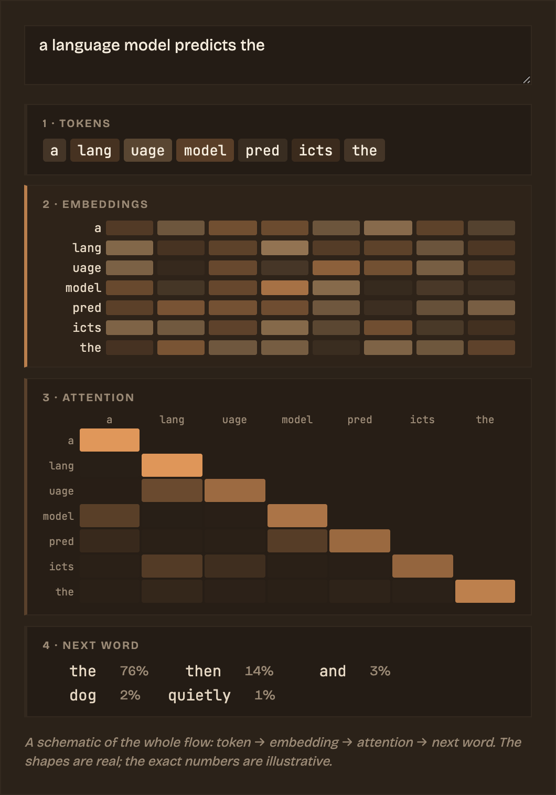
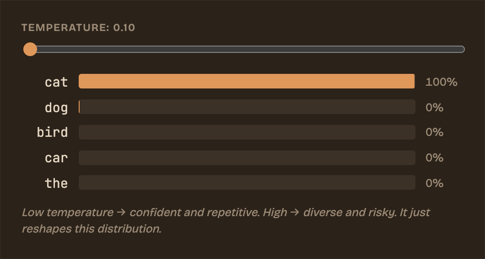
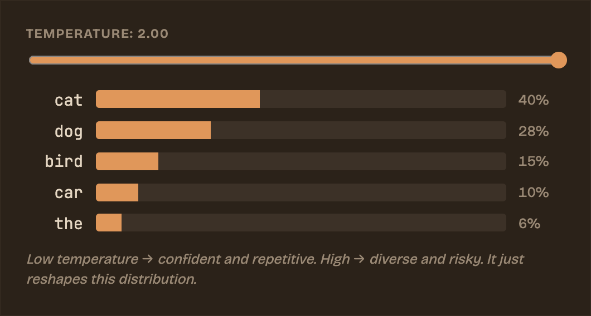
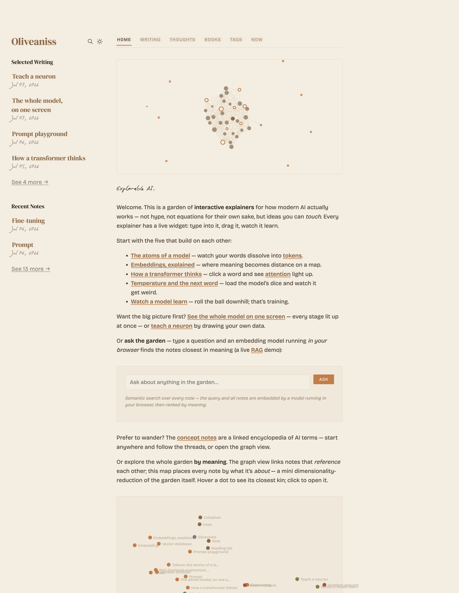
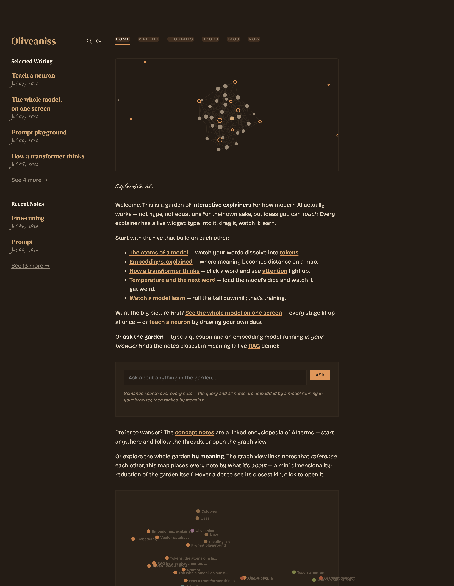

# Recandle

*Interactive explainers that compute how AI works, live in your browser.*

<p align="center">
  
</p>

<p align="center"><em>Type a sentence and watch it travel through the whole model: real GPT-4o tokens, then embeddings, attention, and its guess at the next word, all recomputing as you type. Hover any token to trace it through every stage at once. Nothing here is a diagram, it is the thing running.</em></p>

<p align="center">
  <a href="https://explorable-ai.vercel.app"><b>Live demo</b></a>
  &nbsp;·&nbsp;
  <a href="https://github.com/Recandle/explorable-ai/generate"><b>Use this template</b></a>
  &nbsp;·&nbsp;
  <a href="https://vercel.com/new/clone?repository-url=https://github.com/Recandle/explorable-ai"></a>
</p>

Most explanations of machine learning hand you one of two things: a wall of equations, or a metaphor so loose it falls apart the moment you lean on it. I wanted a third option: pages you can poke at. Every idea here (tokens, embeddings, attention, sampling, training) comes with a small widget you can type into, drag, or watch run. Change the input and the whole thing recomputes in front of you.

The site is live at **https://explorable-ai.vercel.app**.

## Where to start

Five explainers build on one another, in the order a sentence travels through a model:

| # | Explainer | What you do |
|---|---|---|
| 1 | [The atoms of a model](https://explorable-ai.vercel.app/posts/tokens-the-atoms-of-llms) | Watch your words dissolve into tokens |
| 2 | [Embeddings, explained](https://explorable-ai.vercel.app/posts/embeddings-explained) | See meaning turn into distance on a map |
| 3 | [How a transformer thinks](https://explorable-ai.vercel.app/posts/how-a-transformer-thinks) | Click a word and watch attention light up |
| 4 | [Temperature and the next word](https://explorable-ai.vercel.app/posts/temperature-and-sampling) | Load the model's dice and watch it get weird |
| 5 | [Watch a model learn](https://explorable-ai.vercel.app/posts/watch-a-model-learn) | Roll a ball downhill; that is training |

Want the big picture at once? [The whole model on one screen](https://explorable-ai.vercel.app/posts/the-whole-model) runs every stage together for whatever sentence you type, and [teach a neuron](https://explorable-ai.vercel.app/posts/teach-a-neuron) lets you draw your own data and watch a single unit try to fit it.

Around the essays sits a set of short [concept notes](https://explorable-ai.vercel.app/thoughts/): a small, cross-linked encyclopedia of terms like attention, softmax, RAG, and context window. They are meant to be wandered, not read front to back. The home page opens on a force-directed graph of how they connect, plus a second map that places every note by *meaning* rather than by links.

## The explorables

The picture at the top of this page is one of them, the pipeline widget. Each widget begins life as a plain placeholder in Markdown:

```html
<div class="explorable" data-explorable="attention"></div>
```

One site-wide script finds every placeholder on a page and hydrates it into a live canvas or SVG. The widgets read the site's theme variables directly, so they recolour themselves the instant you flip between day and night. A few of them:

| Widget | What it does |
|---|---|
| **pipeline** | Type a sentence, watch real GPT-4o tokens flow through embedding, attention, and next word; hover any token to trace it through every stage at once |
| **attention** | Click any word and see which other words it leans on |
| **temperature** | Drag a slider, watch the next-word odds go from confident to chaotic |
| **learn** / **gradient-descent** | Draw your own data, or roll a ball down a loss curve: that is training |
| **ask the garden** / **garden-map** | A sentence-embedding model runs *in your browser* and ranks notes by meaning |
| **commits** | The contribution calendar on the home page, pulled live from GitHub |

<table>
  <tr>
    <td width="50%"></td>
    <td width="50%"></td>
  </tr>
  <tr>
    <td align="center"><em>Low temperature: one confident guess</em></td>
    <td align="center"><em>High temperature: a flat, random spread</em></td>
  </tr>
</table>

## Tools

Beyond the explainers, a few practical tools run entirely in your browser (no server, no API key):

| Tool | What it does |
|---|---|
| [Token & cost calculator](https://explorable-ai.vercel.app/tools/token-cost-calculator) | Paste any prompt, get exact token counts from the real GPT tokenizer, plus estimated cost across GPT-4o, GPT-4, and Claude |
| [Tokenizer comparison](https://explorable-ai.vercel.app/tools/tokenizer-comparison) | See how GPT-4o and GPT-4 chop the same text into tokens, side by side |
| **Ask AI** | A floating assistant on every page. It runs a small language model *entirely in your browser* (WebLLM / WebGPU), so there is no login and nothing you type leaves your device |

## Connect your AI over MCP

The garden also runs a real **MCP (Model Context Protocol) server**, so any MCP client (Claude, Cursor, VS Code) can plug in and query it. It speaks JSON-RPC 2.0 over Streamable HTTP at `/api/mcp` and exposes:

| Kind | Name | Purpose |
|---|---|---|
| Tool | `search_notes` | Search the garden by keywords |
| Tool | `get_note` | Read one note by its slug |
| Resource | `note://<slug>` | Every note, as a readable resource |

Point a client at `https://explorable-ai.vercel.app/api/mcp`, then ask your assistant to *search the garden for attention*. There is a live walkthrough at [What is MCP?](https://explorable-ai.vercel.app/posts/what-is-mcp).

## Look and feel

Two warm, two-ink palettes: an oat-milk "latte" for day and a deep-espresso "cacao" for night, both lit with caramel and amber. Headings are set in DM Serif Display, body copy in Bricolage Grotesque, and anything code-like in JetBrains Mono.

<table>
  <tr>
    <td width="50%"></td>
    <td width="50%"></td>
  </tr>
  <tr>
    <td align="center"><em>Day · latte</em></td>
    <td align="center"><em>Night · cacao</em></td>
  </tr>
</table>

## Built with

| Piece | Role |
|---|---|
| **[Quartz](https://github.com/jackyzha0/quartz)** | The static-site engine, by [jackyzha0](https://github.com/jackyzha0), MIT licensed. Turns a folder of Markdown into a linked website. Customised here, but the build pipeline, component model, and plugin architecture are Quartz's |
| **Preact** | Rendered to static HTML at build time |
| **unified / remark / rehype** | The Markdown-to-HTML pipeline, with KaTeX for maths and Shiki for syntax highlighting |
| **Transformers.js** | In-browser embedding model behind "ask the garden" and the meaning-map |
| **WebLLM** | In-browser chat model behind the floating Ask AI assistant |
| **Pixi / WebGL** | The home-page node graph |

Most of the interactive widgets live in one script file; the floating assistant is another. Everything else is Quartz.

## Running it locally

You will need Node 22 or newer.

```bash
npm install
npm run serve
```

Then open http://localhost:8080. Edits under `content/` reload on save.

## Repository layout

```
content/            the garden itself: every note and essay, in Markdown
  posts/            the long-form explainers
  thoughts/         short concept notes
  tools/            the browser tools (token calculator, tokenizer comparison)
api/                serverless functions (the MCP server)
```

```
quartz/             the Quartz engine, with my modifications
```

Everything under `quartz/` is Quartz plus my changes to it: the theme and fonts, the page components and explorable widgets, and the layout of each page.

## Make your own

You can grow your own garden from this repo without touching the engine. If you only want the engine, start from [Quartz itself](https://github.com/jackyzha0/quartz) instead — it is the better starting point, and better documented.

1. **Start from it.** Click **[Use this template](https://github.com/Recandle/explorable-ai/generate)** for your own copy, or the **Deploy with Vercel** button above to get a live site in one step.
2. **Write.** Everything the site shows lives in `content/` as Markdown. Delete mine and add yours; links between notes use `[[wikilink]]` syntax, and the graph builds itself from them.
3. **Re-theme.** The two colour palettes and the three fonts are a few lines near the top of the site config. Swap them and the whole site (and every widget) follows.
4. **Add explorables.** Drop a placeholder like `<div class="explorable" data-explorable="attention"></div>` into any note. The widgets are all defined in one script file.

### Deploying

The one-click **Deploy with Vercel** button reads `vercel.json` for you (build with `npm run build`, output in `public/`, on Node 22) and wires up the repo. After that, every push to `main` rebuilds and redeploys automatically, and any other branch gets its own preview URL. The same static output works on Netlify, GitHub Pages, or any static host.

## Credits

This site runs on **[Quartz](https://github.com/jackyzha0/quartz)** by **[jackyzha0](https://github.com/jackyzha0)**, used and modified under the MIT licence. The engine, its build pipeline, and its component and plugin architecture are his work, not mine — `LICENSE.txt` carries his copyright notice alongside mine.

What is mine is everything under `content/` — the writing, the concept notes, the explorable widget designs, and the palette — plus the modifications to the engine that make those widgets work.

Thanks also to the projects the explorables lean on: Transformers.js and WebLLM for running models in the browser, Pixi for the graph, and KaTeX and Shiki for maths and code.
